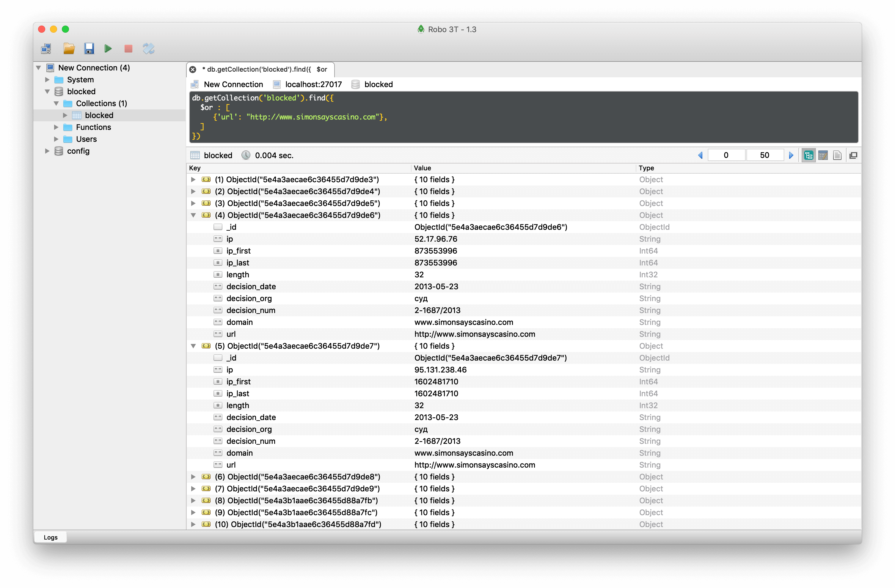
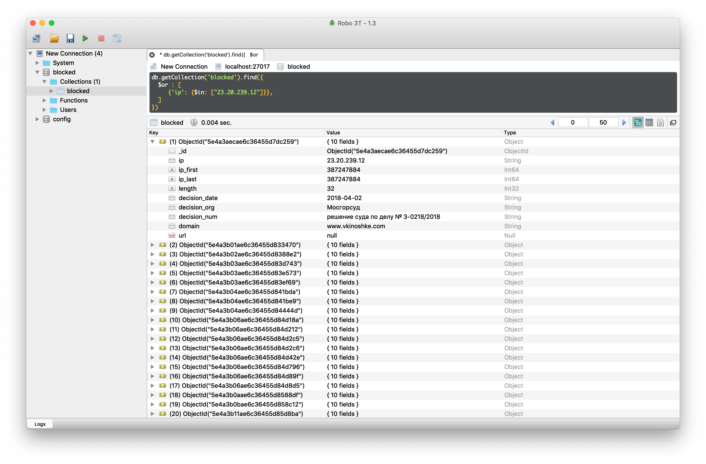
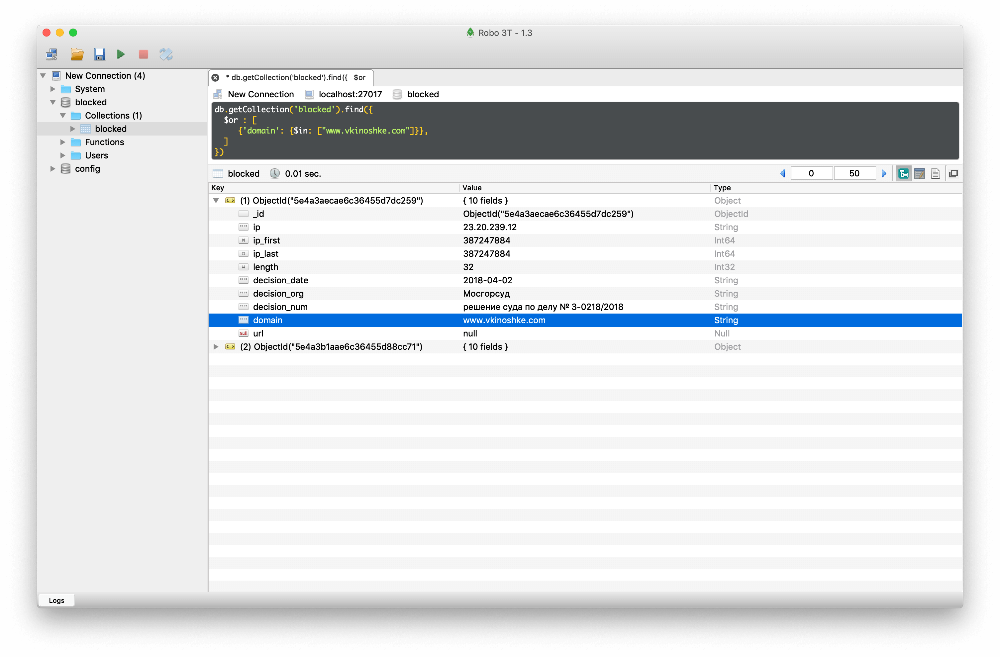

Service parse files from [Register of Internet Addresses filtered in Russian Federation](https://github.com/zapret-info/z-i) and store in MongoDB. IPv6 address are skipped. It is about 1500000 records in database.  

Originally developed by [deNULL](https://github.com/deNULL) and found at [deNULL/isitblockedinrussia.com](https://github.com/deNULL/isitblockedinrussia.com).

By default, service runs one per day `0 0 * * * /updater/update.sh > /proc/1/fd/1 2>&1`, feel free to edit crontab file. 

Run service:

```
docker-compose -f docker-compose.yml up --build -d
```

Run update script manually:

```
docker exec -it zapret-info-updater bash

DESTINATION_DIR=/tmp/archive /updater/update.sh
```

Run MongoDB only for local development:

```
docker-compose -f docker-compose.yml up --no-deps --build mongo
```

### Examples

Try to install [Robo 3T](https://www.robomongo.org/download) to run the examples. 

```
db.getCollection('blocked').find({
  $or : [
     {'url': "http://www.simonsayscasino.com"},
  ]
})
```



```
db.getCollection('blocked').find({
  $or : [
     {'ip': {$in: ["23.20.239.12"]}},
  ]
})
```



```
db.getCollection('blocked').find({
  $or : [
     {'domain': {$in: ["www.vkinoshke.com"]}},
  ]
})
```


